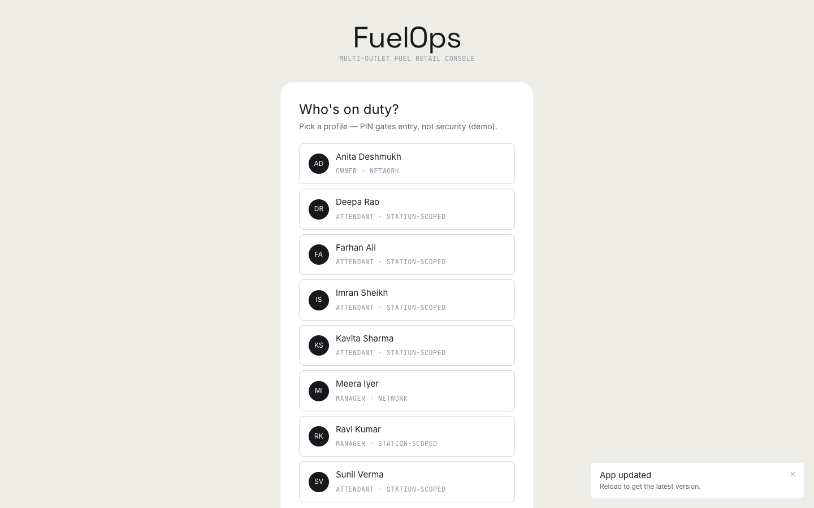
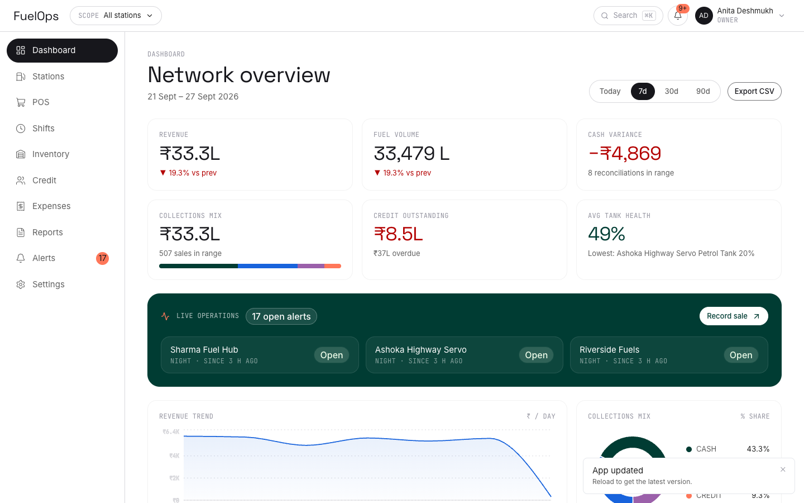
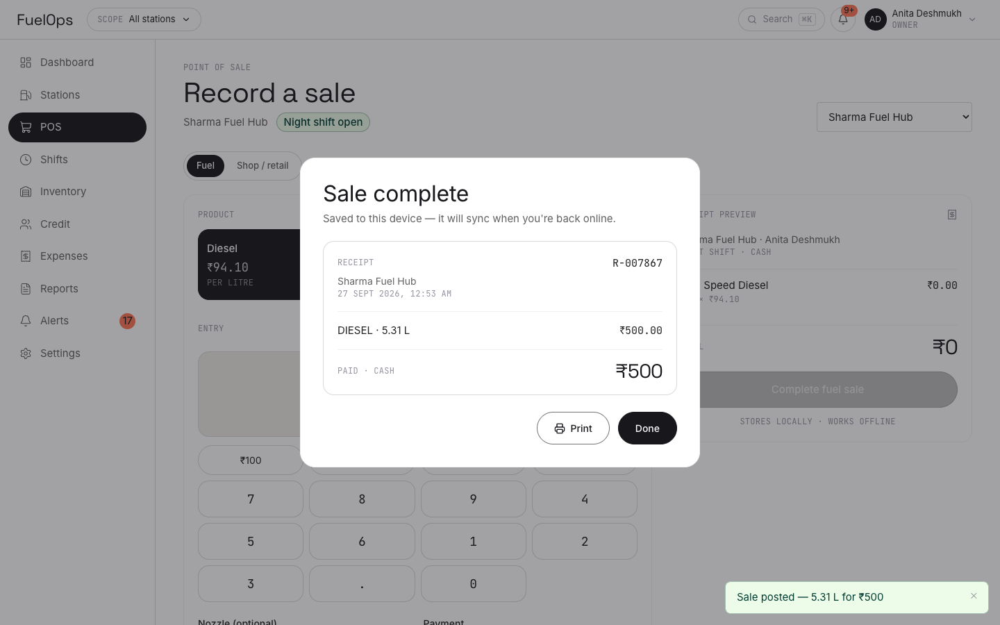
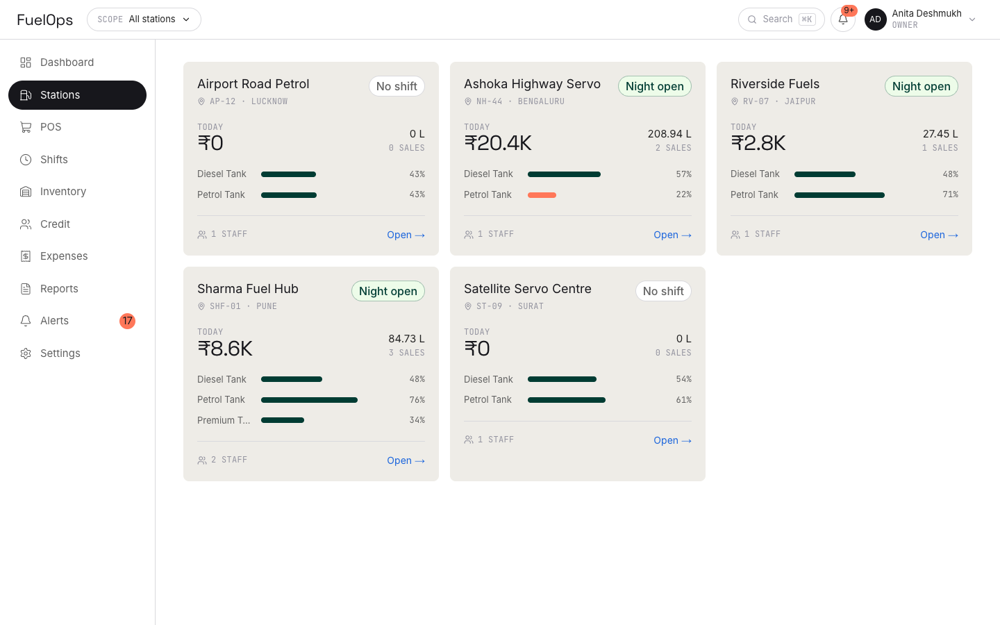
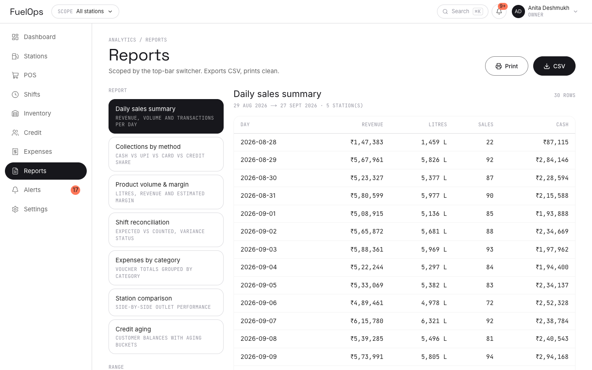

# FuelOps — Multi-Outlet Fuel Station Dashboard (Prototype)

Local-first, offline-capable dashboard to run multiple fuel retail outlets from one
place: network KPIs, POS, shifts & cash reconciliation, tank/wet-stock monitoring,
credit & fleet ledgers, expenses, reports — with a professional, restrained UI.

**Prototype scope:** all data lives in your browser (IndexedDB); works fully offline
after first load; seeded with 90 days of deterministic demo data across 5 outlets.

## Screenshots

| | |
|---|---|
|  |  |
|  |  |
|  | |

## Stack

Next.js 16 (static export) · TypeScript (strict) · Tailwind CSS v4 · Dexie/IndexedDB ·
Zustand · Recharts · react-hook-form + zod · Vitest · Hand-rolled service worker (PWA)

## Quick start

```bash
npm install
npm run dev        # http://localhost:3000
```

First load seeds demo data (~8–12k rows, shown with a progress screen).

**Sign in:** pick a profile → PIN `1234`
(Owner: Anita · Manager: Ravi · Attendant: Imran).

## Commands

| Command | What it does |
|---|---|
| `npm run dev` | dev server |
| `npm run lint` | ESLint |
| `npm run typecheck` | `tsc --noEmit` |
| `npm test` | Vitest (domain logic) |
| `npm run build` | static export to `out/` + service worker |
| `npm run preview` | serve `out/` |

## Demo script

1. **Dashboard** — network revenue, litres, variance, collections mix, 90-day trends,
   outlet leaderboard, live-ops band.
2. **⌘K** → "New sale" → POS → ₹1,000 Petrol on UPI → receipt.
3. **Shifts** → close a shift ₹200 short → variance flagged (coral chip) + alert raised.
4. **Inventory** → record a dip under critical level → tank bar + alert update live.
5. **Credit** → aging buckets (0/30/60/90+) and limit-breach customer.
6. **Reports** → Daily closing → CSV export / print.
7. **DevTools → Offline** → the whole app keeps working (local-first + service worker).
8. **Settings** → Export JSON backup / reset demo data.

## Architecture (short version)

```
routes → feature components → hooks (liveQuery) → repositories → Dexie (IndexedDB)
                                                     ↳ pure domain logic (unit-tested)
static shell precached by service worker → full offline operation
```

See `docs/` for the full planning set: PRD, SDA, TRD, schema, app-logic, UI/UX and
implementation plan. Design system source: `DESIGN.md`.

## Roles

| | Owner | Manager | Attendant |
|---|---|---|---|
| Network scope | all stations | own / network | own station |
| POS, shifts, dips | ✓ | ✓ | ✓ |
| Expenses, credit, stock | ✓ | ✓ | — |
| Reports | ✓ | ✓ | own closing |
| Settings / staff / backup | ✓ | — | — |

## Offline & privacy

- No servers, no telemetry — data never leaves the device.
- PINs are salted SHA-256 locally; **they are a convenience lock, not real security**.
- Full JSON backup/restore from Settings for portability.

## Distribution

MIT licensed — see `LICENSE`. CI runs lint/typecheck/test/build on every push and
deploys `out/` to GitHub Pages from `main`.

## Roadmap (post-prototype)

Cloud sync with conflict resolution · pump/EDR integrations · GST invoicing ·
loyalty · scheduled email reports.
